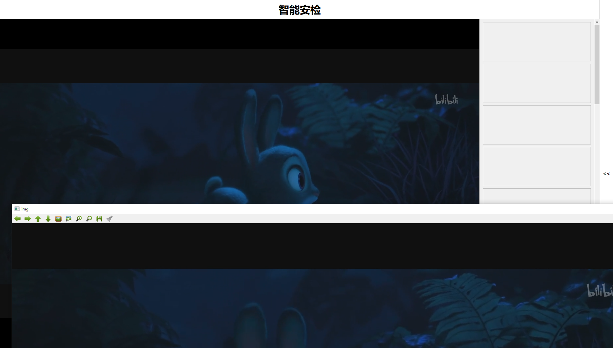
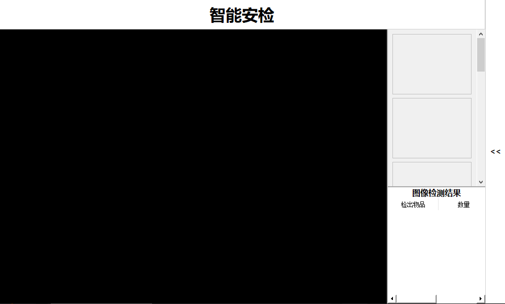
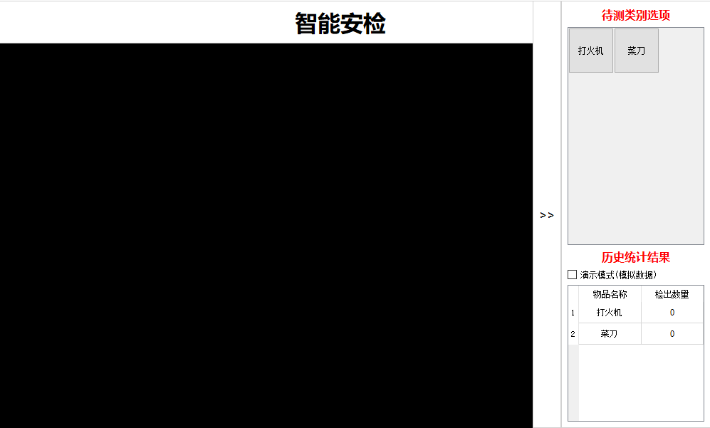
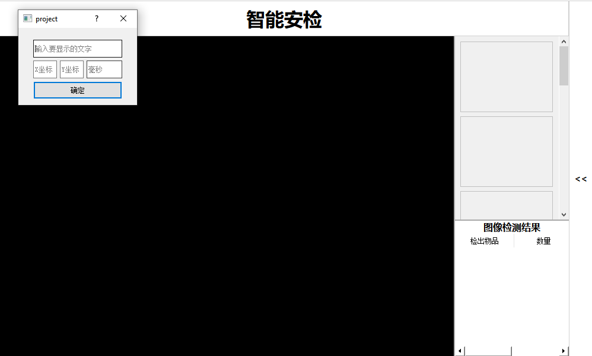
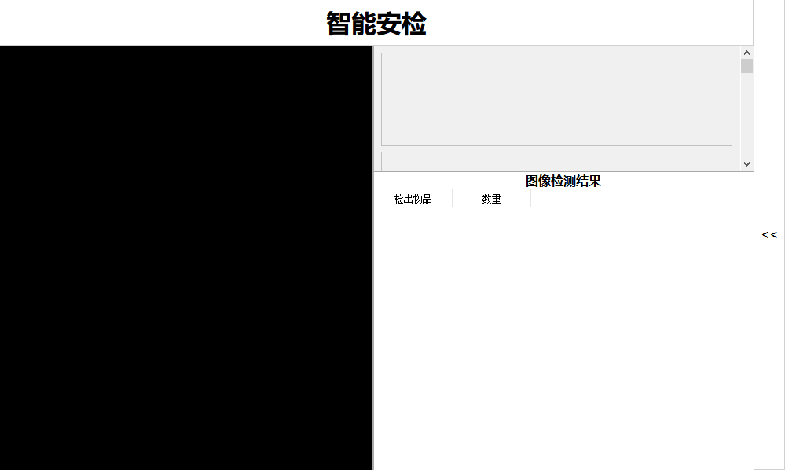
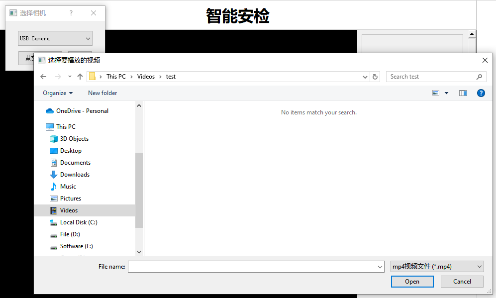
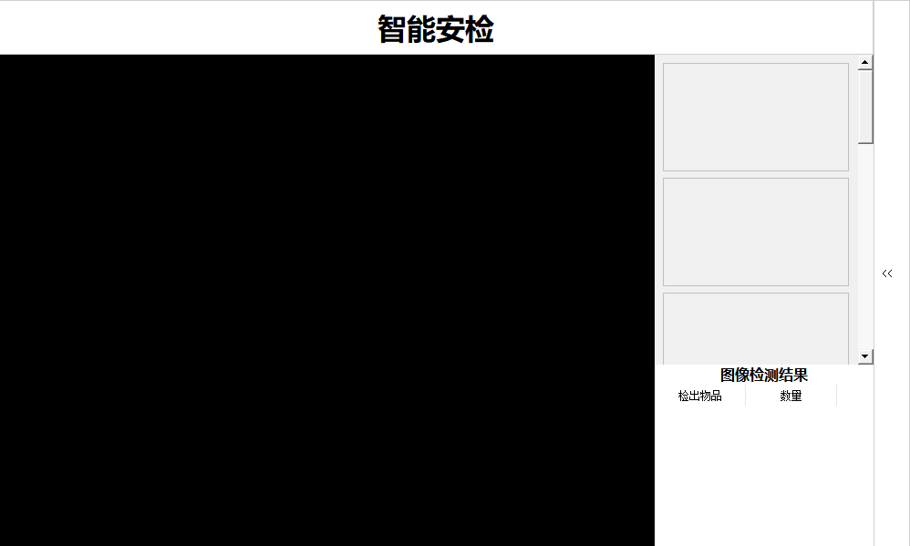

# 开发内容
> DevBy: Eureka

## Date: Nov 13
1. 在 Windows 下编译器修改为修改 MSVC2019_64bit 需重新编译opencv动态库
> 因 Windows 下 onnxruntime 官方提供的是 MSVC 动态库
2. 添加 onnxruntime
3. 双击截图添加模型识别并画线，使用前需添加模型路径
``` cpp   
   //in my_transform.cpp 
   //line 16
   session->Initialize("PutYourModelPath.onnx");
```
4. 新增识别线程池(因开发环境性能不足无法测试)

## Date: Oct 30
1. - 添加openCV库，使用 QT5.15.2_MinGW_64bit 编译
   - 编译使用openCv源码版本为4.2.0 下载链接为 https://codeload.github.com/opencv/opencv/zip/refs/tags/4.2.0
    > Tips: 目前使用的编译器版本为 QT5.15.2_MinGW64bit 如使用其他版本编译器报无法正常链接库请尝试用QT5.15.2_MinGW64bit或将项目内Libs的库修改至当前环境支持的库
2. 可在 智能安检 标题栏内双击，会截取双击后的下一帧完整图像进行截图(完整大小未压缩)，转换为openCV Mat并展示出来(效果见以下截图)
> 原先双击填写参数失效，可在之前提交进行测试
``` cpp
// 考虑到转换性能问题
// 创建了 my_transform 类并添加其他线程进行 QImage 到 cv::Mat 的转换防止主线程图像卡顿
// 如想使用其他线程进行转换需在使用信号触发 my_transform 的 GetImg(QImage) 槽函数
public slots:
    void my_transform::GetImg(QImage image) // in my_transform.h
```
3. 考虑到openCV动态库过大就不添加至版本管理，我会单独发到群里
> Pro文件内库已配置为相对路径，下载并解压到项目目录内Libs文件夹即可使用

> 因为截图是完整大小所以截图展示不全


## Date: Oct 28
1. 调整弹出方式为点击列表侧边栏，列表为收起状态时点击会弹出，列表为弹出状态时点击会收起

### 收起状态

### 弹出状态

   
## Date: Oct 20
1. 修改视频解码过程，重写 QAbstractVideoSurface 以获取视频流帧数据进行绘制
>  因原先VideoWidget使用的是GPU进行解码渲染，现在使用继承重写的myVideoSurface类，导致原先GPU内容变由CPU执行，致使CPU占用率微小提升，GPU占用率下降
1. 修改绘制函数,实现方框绘制，文字绘制等
2. 可双击 智能安检 标题栏填写参数进行测试 (效果见以下截图)
> 原先双击进入全屏失效，可在老版本测试体验
1. 视频和图片列表中间添加滑块可自行拖动调整画面大小 (见以下截图)
2. 图片和实时数据中间添加滑块可自行拖动调整画面大小 (见以下截图)
   
### 绘制效果

### 滑块效果

## Date: Oct 15
1. 添加播放MP4视频选项
2. 添加右侧列表弹出倒计时 

具体倒计时可自行在代码处调整
``` cpp
// in widget.h
bool Widget::eventFilter(QObject *watched, QEvent *event){
    if(watched == flist){
        if(event->type()==QEvent::Enter){
            // 鼠标放置后多少毫秒弹出
            timer->start(3000);
    }
}
```


## Date: 241012
1. 移除VLC-QT库，无需添加vlc动态链接库
2. 无限制编译器，mingw和msvc均可
3. 右键标题栏选择摄像头即可打开
4. 图片列表可下拉，点击可选中图片
5. 图片详细信息因未计划显示信息内容暂无显示
